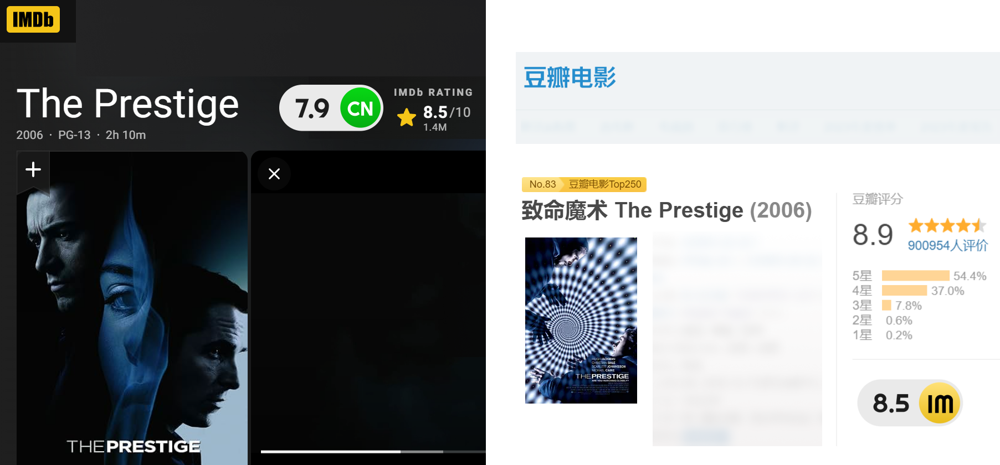
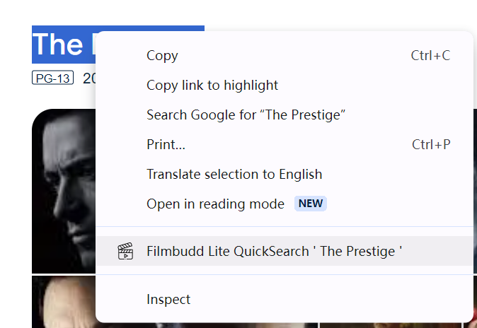

# The Filmbudd Lite Extension

Installation [chrome](https://chromewebstore.google.com/detail/filmbudd-lite/knjgfggpjlmjaoknobdinelbbpmcfcjh)
[edge](https://microsoftedge.microsoft.com/addons/detail/filmbudd-lite/fafjcmjkhdojjcdpailngmgcjjnidhjo)

[English](./README.md) | [简体中文](./README.zh_CN.md)

The Filmbudd Lite Extension is the best movie productivity tool for movie fans.

Why Filmbudd?

- 💡 Simple: Filmbudd Lite is so simple you already know how to use it.
- 🛡️ Secure: Filmbudd Lite keeps your data safe from hacker attacks.
- 🍌 Open: Filmbudd Lite uses open API and source code free for everyone.

Features

- Displays the Douban ratings and number of votes on IMDb, or vice versa.
- Allows you to jump from IMDb to Douban with a single click, and vice versa.
- Transform IMDb ID text to clickable link on Douban.
- Enables you to search for a selected keyword on IMDb/Douban.

Preview

OPTINOAL: generate or update [Connect RPC](http://connectrpc.com/) client code

    cd path/to/filmbudd/source/root/
    pnpm i
    npx buf generate --template buf.gen.lite.frontend.yaml

Compilation Guide

    npm install -g pnpm
    pnpm i
    pnpm dev
