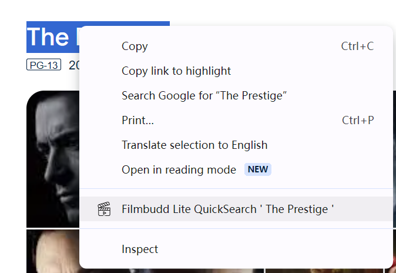

# Filmbudd Lite 插件

安装插件 [chrome](https://chromewebstore.google.com/detail/filmbudd-lite/knjgfggpjlmjaoknobdinelbbpmcfcjh)

[English](./README.md) | [简体中文](./README.zh_CN.md)

Filmbudd Lite 插件是电影爱好者最佳的效率工具。

为什么选择 Filmbudd？

- 💡 易用: Filmbudd Lite 简单易用无需配置；
- 🛡️ 安全: Filmbudd Lite 保护您的数据免受黑客攻击；
- 🍌 开放: Filmbudd Lite 使用开放的 API 和对所有人公开源代码。

功能

- 在豆瓣电影页面上显示 IMDb 评分，或者反过来；
- 在豆瓣电影和人物页面点击 IMDb ID 一键跳转 IMDb，或者反过来；
- 在豆瓣电影或 IMDb 上搜索选中关键字；

预览

编译

    npm install -g pnpm
    pnpm i
    pnpm dev
